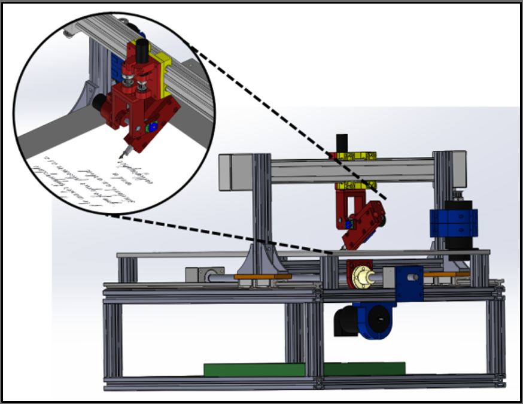

#Calligraphy Robot

My senior thesis project at WPI in 2013-2014. My objective was to implement force-control on the nib of a calligraphy pen to achieve a writing robot that could write true calligraphy script with varying stroke thicknesses.

I used a series elastic actuator on a rotational joint to measure and control the force. I designed the entire mechanical system and programmed the force control. The position control programming was done by two grad students working on continuous velocity control. We did not achieve a true font but were able to draw some basic lines and curves with varying thicknesses by the end of the year.

You can see more details in my [final presentation](Sensitive_Calligraphy_Robot_Final_Presentation.ppsx) that has my speaker notes copied onto the slides.

