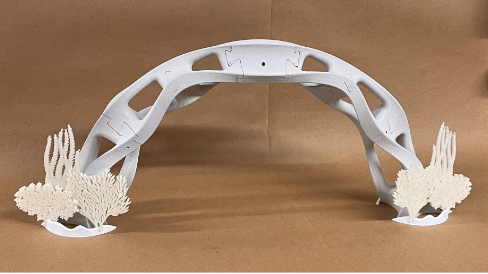

# FDM 3D Printed Bridge

Skills:
* FDM 3D printing (setting print parameters, failure diagnosis, machine maintenance)
* CAD (Solidworks)
* FEA (nTopology)
* Lattices (nTopology)

I worked in a team of 3 to iterate on design for FDM-printed bridge to span 450mm gap and support 10 kgs. Aesthetics were also part of the judging criteria. The bridge had to be made of multiple pieces with a maximum dimension of 230mm and had to hold together without any adhesive. Pin joints were permitted, but we chose to not use any for aesthetics.
- I used nTopology to conduct Finite Element Analysis and static analysis on CAD prototypes.
- I experimented with lattices and topology optimization in nTopology to reduce weight of parts and improve aesthetics. Other team members incorporated the results of all team members' experiments into our final CAD model.
- I calibrated print parameters to improve layer adhesion and print quality while maintaining part strength and minimizing supports. This included adjusting print parameters for different types of filaments, determining offsets for tolerances of part fit, and helping to diagnose print failures of prototype pieces. I printed most of our final bridge parts on my home printer (FlashForge Adventurer 3 Lite).
- I created 2d coral elements that were also 3d printed to emphasize the water-inspired aesthetics of our bridge.
- More images of our design and manufacturing process can be found in [our presentation](ME557_Bridge.pdf)

