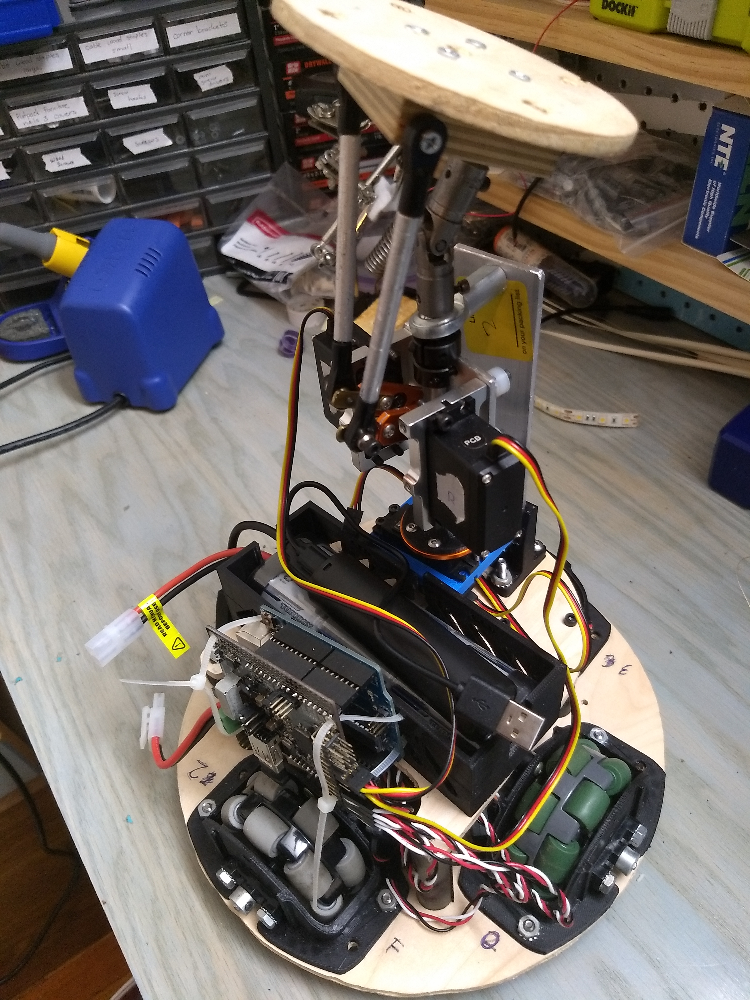

# Mimikyu Animatronic Pokemon

This is an ongoing personal project.

I wanted to create an animatronic Mimikyu, a creature from the popular Nintendo game series.

I designed an omniwheel base for floaty ghost-like movement and a neck joint based on servo control with a universal joint. 

I used casting & molding techniques to create a plastic body shell in a rounded custom shape and silicone tentacles. 

Programming uses Arduino-based controls with a [ServoShock controller](http://www.servoshock.com/). At the moment, all puppeteering happens via the controller, but I hope to add pre-programmed animated routines in the future.

