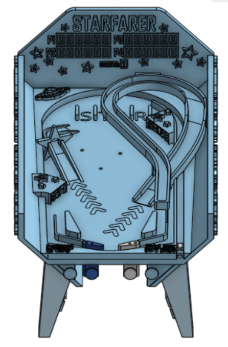
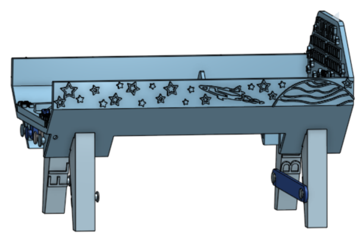
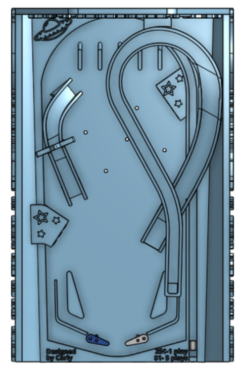

#SLA Print Challenge

We were challenged to design an SLA (resin) 3D print that would fit in a 37mm x 37mm x 75mm volume and make use of two walls and the floor of that volume.

I designed a miniature pinball machine which could be printed as a single print, with supports holding all the pieces within the volume. After curing, the supports could then be broken and brought together with snap-together assembly. The paddles, plunger, and side buttons utilize metal pin joints / shafts, springs, and rubber bands that were not printed.

The pinball machine featured space-themed decorations, articulated paddles and launcher, and LED lighting. 

My CAD models, done in Onshape:

A video of the actuation. The paddles had pin joints that went through a hole and a slot to a lower half under the playing surface. These had an extrusion where a rubber band attached to a fixed surface. When the side buttons were pressed, their attached shaft pressed on the lower half of the paddle, causing it to rotate, the rubber band brings the paddle back to its rest position. The launch plunger usese a spring on a metal shaft. The ball was a tiny ball bearing.

To make it look more like a real pinball game, I mounted LED lights behind/under the playing surface.

