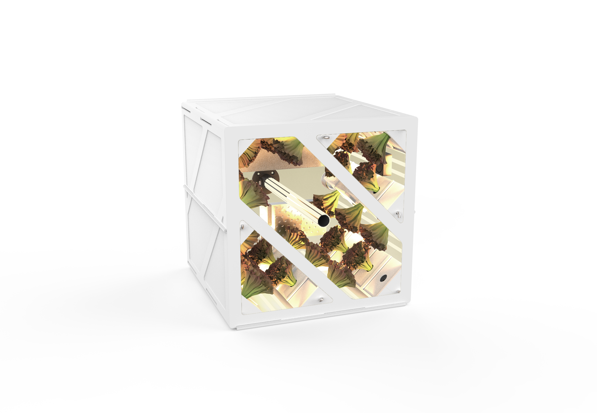
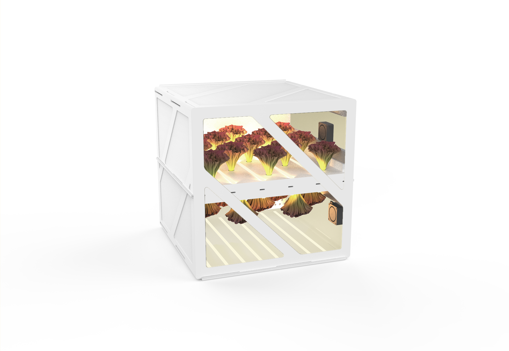

In August 2019 I put together a team at Draper for the Professional Track of the [Growing Beyond Earth Maker](https://www.instructables.com/contest/beyondEarth/) Challenge, a NASA crowd-sourcing competition. We had ~6 months to create a proposal to redesign the VEGGIE system on the ISS to use space more efficiently to maximize its food production. We had to increase plant density within given volumetric constraints, including space for light and water systems.

I led research & development of 2 novel designs while managing the team of 8, as well as the budget, procurement, task delegation, and schedule.
I created CAD designs in OnShape and rapidly iterated prototypes via FDM 3D printing. We successfully grew some lettuce plants in both prototype systems. (Not a requirement of the contest.)

Our design proposals are documented on [Instructables](https://www.instructables.com/member/Draper+AstroGarden+Team/). We submitted two designs which we named Towers & Checkerboard. Towers was selected as a finalist design.
- [Towers](https://www.instructables.com/Towers-AstroGarden/)
- [Checkerboard](https://www.instructables.com/Checkerboard-AstroGarden/)
  

