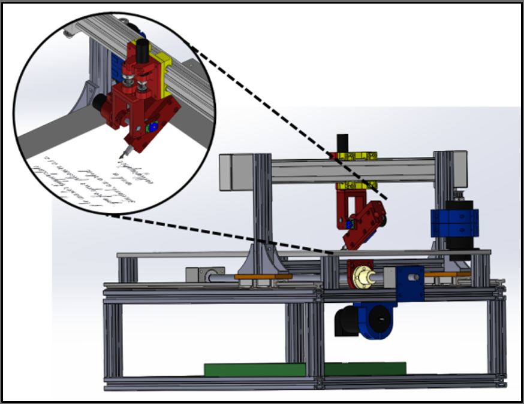

# Tactile Robotics

## Haptic Sensors
As an undergraduate, I worked in Professor Torres-Jara's [Sensitive Robotics Lab](https://eduardotorresjara.com/) at WPI. He was studying the use of compliant sensing for haptic feedback. I assisted the upperclass and graduate students by helping prepare the "skin" used in projects such as the [characterization of tactile sensors](https://ieeexplore.ieee.org/abstract/document/6691907) and the [Sensitive Walking Platform](https://digital.wpi.edu/downloads/vm40xt08b).

Included here in this portfolio is a [draft of some unpublished work](Improving_IR_Sensors_for_Use_in_Sensitive_Robotics.pdf) I did [running tests](Mold_Test_Data.pdf) on how to reduce light pollution on the IR sensors that measured the deflection of the soft spheres.

## Caligraphy Robot
My senior thesis project at WPI in 2013-2014. My objective was to implement force-control on the nib of a calligraphy pen to achieve a writing robot that could write true calligraphy script with varying stroke thicknesses.

I used a series elastic actuator on a rotational joint to measure and control the force. I designed the entire mechanical system and programmed the force control. The position control programming was done by two grad students working on continuous velocity control. We did not achieve a true font but were able to draw some basic lines and curves with varying thicknesses by the end of the year.

You can see more details in my [final presentation](Sensitive_Calligraphy_Robot_Final_Presentation.ppsx) that has my speaker notes copied onto the slides.

